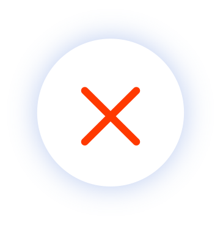

<!DOCTYPE html>
<html>

<head>
    <meta name="viewport" content="width=device-width,initial-scale=1">
    
    

    

    
    

    
    <link rel="stylesheet" href="https://stackpath.bootstrapcdn.com/bootstrap/4.3.1/css/bootstrap.min.css" integrity="sha384-ggOyR0iXCbMQv3Xipma34MD+dH/1fQ784/j6cY/iJTQUOhcWr7x9JvoRxT2MZw1T" crossorigin="anonymous">

    

</head>

<body>

    

        

            <a-scene id="hey" embedded>
                <a-sound src="src: url(Sequence 02.mp3)" autoplay="true" position="0 2 5"></a-sound>
                <a-entity camera look-controls>
                    <a-entity cursor="fuse: true; fuseTimeout: 500" position="0 0 -1" geometry="primitive: ring; radiusInner: 0.02; radiusOuter: 0.03" material="color: black; shader: flat">
                    </a-entity>
                    <a-entity id="clickPosition" position="0 0 -100"></a-entity>
                    <a-entity id="pic" cursor-listener></a-entity>
                </a-entity>
                <a-sky id="you" src="360_0096_Stitch_XHC.JPG"></a-sky>

            </a-scene>
        

        

        

            

                
            

            

                

                    

                        <!--header-->
                        

                            

                                <button id="btn" onclick="addElementInput()">type</button>
                                <button id="btn" onclick="addElementInput1()">image</button>
                            

                            <h3>Add new things!</h3>
                        

                        <!--body-->
                        

                            

                        

                        <!--footer-->
                        

                            
                        

                    

                

            

        

        
        

            <button id="addpoint" cursor-listener>+</button>
        

    

</body>

</html>
